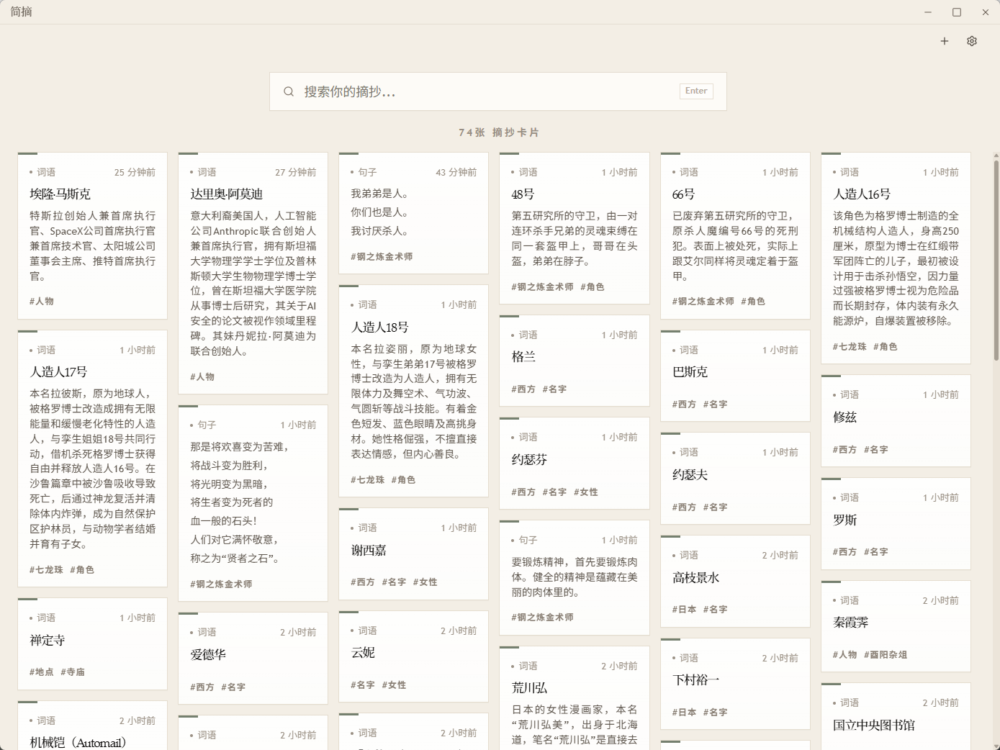
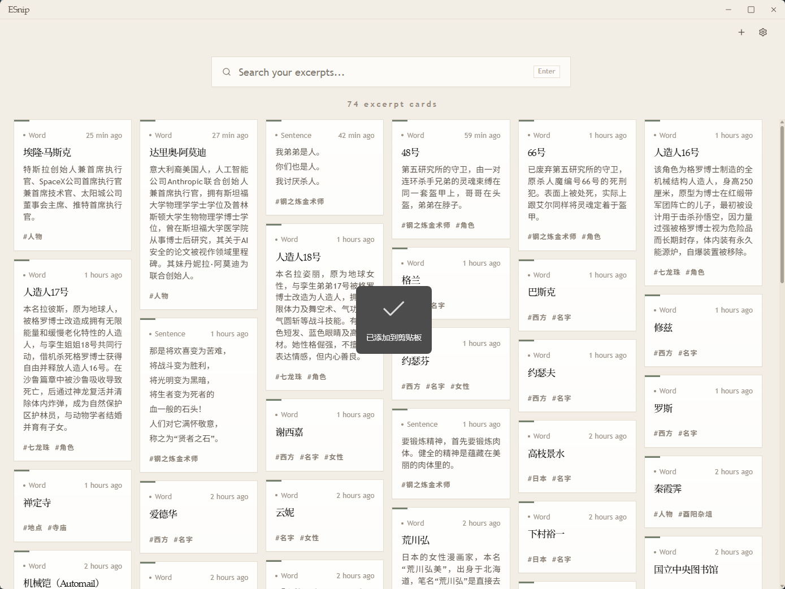

  <h1>ESnip - 简摘</h1>
  
  
  
  
  

---

**[中文](#中文) | [English](#english)**

---

<h2 id="中文">中文</h2>

## ✨ 简摘

开源、免费的桌面摘抄工具。

界面预览：

## ✨ 主要特性

1. 阅读任意内容时，选中文本后，可用设定好的**全局快捷键**将选中文本添加入摘抄库。

2. 支持按关键字、标签进行搜索，支持模糊搜索。

3. 基于 Tauri 框架开发，安装包、系统内存占用低。

4. 基于 sqlite 本地保存词条，数据由你掌控。

## ✨ 使用方法

1. 下载最新版的 Release 安装包进行安装，以后可随版本进行自动更新。

2. 在界面右上角的设置界面，设定自定义词库的目录，及界面取词快捷键。

3. 打开软件界面，在关键字输入框内输入关键字，进行筛选、查询。

---

<h2 id="english">English</h2>

## ✨ ESnip

An open-source, free desktop snippet capture tool.

UI Preview:

## ✨ Key Features

1. While reading any content, select text and use the configured **global shortcuts** to save it to your snippet library.

2. Search by keywords and tags, with fuzzy search support.

3. Built on the Tauri framework — low install size and memory footprint.

4. Stores entries locally using SQLite — your data stays under your control.

## ✨ Getting Started

1. Download the latest release installer and install. Automatic updates will be available with future releases.

2. Open the settings in the top-right corner of the app to configure a custom library directory and global capture shortcuts.

3. Open the app and type keywords in the search bar to filter and find your snippets.

---

## 🤝 支持 / Support

如果您觉得 ESnip 有帮助，请考虑支持其开发 / If you find ESnip helpful, please consider supporting its development:

- [⭐ 在 GitHub 上给项目加星 / Star the project on GitHub](https://github.com/pingo8888/ESnip)
- [🐛 报告问题或建议功能 / Report issues or suggest features](https://github.com/pingo8888/ESnip/issues)

---

## 📄 许可证 / License

GNU AGPL v3 — Free to use and modify. / 可自由使用和修改。

---

**Made with ❤️ by [pingo8888](https://github.com/pingo8888)**
